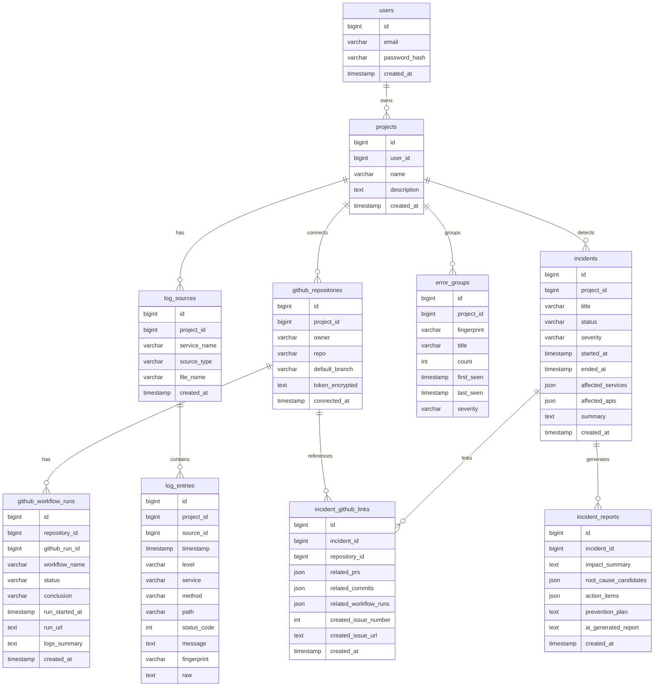

# LogLens AI GitHub Connector 기능명세서 및 ERD

## 1. 기능명세서

## 1.1 사용자 인증 기능

### 목적

사용자가 자신의 프로젝트와 GitHub 저장소를 관리할 수 있도록 계정 기능을 제공한다.

### 주요 기능

| 기능      | 설명               | 우선순위 |
| ------- | ---------------- | ---- |
| 회원가입    | 이메일과 비밀번호로 가입    | MVP  |
| 로그인     | JWT 기반 로그인       | MVP  |
| 내 정보 조회 | 현재 로그인 사용자 정보 조회 | MVP  |
| 로그아웃    | 클라이언트 토큰 제거      | MVP  |

### 입력 정보

* email
* password

### 출력 정보

* access_token
* user 정보

---

## 1.2 프로젝트 관리 기능

### 목적

사용자가 여러 프로젝트를 생성하고, 각 프로젝트별 GitHub 저장소와 로그를 관리할 수 있도록 한다.

### 주요 기능

| 기능         | 설명                         | 우선순위 |
| ---------- | -------------------------- | ---- |
| 프로젝트 생성    | 프로젝트 이름과 설명 등록             | MVP  |
| 프로젝트 목록 조회 | 사용자의 프로젝트 목록 조회            | MVP  |
| 프로젝트 상세 조회 | 프로젝트별 연결 저장소, 로그, 장애 현황 조회 | MVP  |
| 프로젝트 수정    | 이름, 설명 수정                  | 2차   |
| 프로젝트 삭제    | 프로젝트 삭제                    | 2차   |

### 프로젝트 상태 정보

* 연결된 GitHub 저장소 수
* 최근 실패 workflow 수
* 업로드된 로그 수
* 감지된 장애 후보 수
* 미해결 incident 수

---

## 1.3 GitHub 저장소 연결 기능

### 목적

사용자가 GitHub 저장소를 연결하고, 해당 저장소의 Actions, PR, commit, issue 데이터를 조회할 수 있도록 한다.

### 주요 기능

| 기능        | 설명                     | 우선순위 |
| --------- | ---------------------- | ---- |
| 저장소 연결    | owner, repo, token 입력  | MVP  |
| 연결 테스트    | GitHub API 호출 가능 여부 확인 | MVP  |
| 저장소 목록 조회 | 프로젝트에 연결된 저장소 조회       | MVP  |
| 저장소 상세 조회 | 기본 브랜치, 최근 상태 확인       | MVP  |
| 저장소 연결 해제 | 연결 정보 삭제               | 2차   |

### 입력 정보

* project_id
* owner
* repo
* access_token

### 보안 요구사항

* GitHub token은 평문 저장 금지
* DB 저장 시 암호화
* 응답 body에 token 노출 금지
* 로그 출력 금지

---

## 1.4 GitHub Actions 실패 분석 기능

### 목적

GitHub Actions의 실패 workflow를 탐지하고, 실패 로그를 AI가 요약하여 원인 후보와 수정 방향을 제시한다.

### 주요 기능

| 기능                  | 설명                      | 우선순위 |
| ------------------- | ----------------------- | ---- |
| workflow run 조회     | 최근 Actions 실행 목록 조회     | MVP  |
| failed workflow 필터링 | conclusion=failure만 추출  | MVP  |
| workflow 로그 다운로드    | 실패 로그 조회                | MVP  |
| 실패 로그 요약            | AI가 핵심 오류 요약            | MVP  |
| 수정 체크리스트 생성         | 개발자가 확인할 작업 생성          | MVP  |
| Issue 생성            | 분석 결과를 GitHub Issue로 등록 | MVP  |

### 분석 대상

* TypeScript build error
* ESLint error
* pytest failure
* Docker build failure
* dependency install failure
* environment variable missing
* deployment failure

### AI 출력 정보

```json
{
  "error_type": "TypeScript build failure",
  "summary": "빌드 단계에서 타입 불일치로 실패했습니다.",
  "root_cause_candidates": [
    {
      "title": "API 응답 타입과 프론트 타입 정의 불일치",
      "confidence": 0.78,
      "evidence": ["Property bbox_format does not exist"],
      "verification_steps": ["응답 DTO 확인", "프론트 타입 정의 확인"]
    }
  ],
  "recommended_actions": [
    "타입 정의 수정",
    "npm run build 재실행"
  ]
}
```

---

## 1.5 서버 로그 업로드 기능

### 목적

운영 서버 로그를 업로드하여 로그 파싱, 에러 그룹핑, 장애 후보 탐지를 수행한다.

### 지원 파일

| 확장자    | 설명            |
| ------ | ------------- |
| .log   | 일반 서버 로그      |
| .txt   | 텍스트 로그        |
| .jsonl | JSON Lines 로그 |
| .csv   | CSV 로그        |

### 주요 기능

| 기능        | 설명                                     | 우선순위 |
| --------- | -------------------------------------- | ---- |
| 로그 파일 업로드 | 로그 파일 서버 전송                            | 2차   |
| 서비스 선택    | frontend/backend/ai-server/db/nginx 선택 | 2차   |
| 로그 파싱     | 공통 로그 구조로 변환                           | 2차   |
| 로그 목록 조회  | 파싱된 로그 확인                              | 2차   |

### 공통 로그 구조

```ts
type ParsedLog = {
  timestamp: string;
  level: "INFO" | "WARN" | "ERROR" | "CRITICAL";
  service: string;
  method?: string;
  path?: string;
  statusCode?: number;
  message: string;
  fingerprint?: string;
  raw: string;
};
```

---

## 1.6 에러 그룹핑 기능

### 목적

반복되는 에러 로그를 하나의 그룹으로 묶어 장애 분석 효율을 높인다.

### 그룹핑 기준

* 에러 메시지
* HTTP status code
* API path
* service
* stack trace 핵심 라인
* fingerprint

### fingerprint 생성 예시

```txt
Database connection timeout at pool 12
Database connection timeout at pool 15
```

변환:

```txt
Database connection timeout at pool {number}
```

---

## 1.7 장애 후보 탐지 기능

### 목적

로그 집계 결과를 기반으로 장애 가능성이 높은 시간 구간과 API를 탐지한다.

### 탐지 규칙

| 조건                    | 판단           |
| --------------------- | ------------ |
| 5분 내 ERROR 30건 이상     | 장애 후보        |
| 특정 API 500 오류 10건 이상  | API 장애       |
| 같은 fingerprint 20회 이상 | 반복 장애        |
| 502/503/504 급증        | 외부 연동/프록시 장애 |
| DB timeout 반복         | DB 장애        |
| connection refused 반복 | 서비스 다운       |

### 심각도 계산 예시

```txt
severity_score =
  ERROR_COUNT * 2
+ CRITICAL_COUNT * 5
+ AFFECTED_API_COUNT * 3
+ 5XX_COUNT * 2
```

|     점수 | 심각도      |
| -----: | -------- |
|   0~20 | LOW      |
|  21~50 | MEDIUM   |
| 51~100 | HIGH     |
| 101 이상 | CRITICAL |

---

## 1.8 GitHub 변경사항 연관 분석 기능

### 목적

장애 발생 시간 기준으로 최근 PR과 commit을 조회해 장애와 코드 변경사항의 연관 가능성을 분석한다.

### 주요 기능

| 기능               | 설명                                | 우선순위 |
| ---------------- | --------------------------------- | ---- |
| 최근 PR 조회         | 장애 시간 전후 PR 조회                    | 3차   |
| 최근 commit 조회     | 장애 시간 전후 commit 조회                | 3차   |
| 변경 파일 조회         | PR/commit의 변경 파일 목록 확인            | 3차   |
| 장애 API와 파일 연관 분석 | path, service, filename 기반 관련성 계산 | 3차   |

### 연관 분석 기준

| 기준              | 예시                                      |
| --------------- | --------------------------------------- |
| API path와 파일명   | `/api/cctvs/stream` ↔ `stream/route.ts` |
| 서비스명과 디렉터리      | backend ↔ `flask-vm/`                   |
| 에러 메시지와 변경 파일   | bbox ↔ `BboxOverlay.tsx`                |
| 장애 시간과 merge 시간 | 장애 직전 병합 PR 우선                          |

---

## 1.9 AI 장애 리포트 생성 기능

### 목적

장애 후보, 에러 그룹, GitHub 변경사항을 기반으로 AI가 장애 리포트를 생성한다.

### AI 입력

* 장애 시간
* 영향 API
* 영향 서비스
* 에러 그룹
* 주요 로그 샘플
* 최근 PR
* 최근 commit
* Actions 실패 요약

### AI 출력

* 장애 요약
* 원인 후보
* 근거
* 신뢰도
* 확인 절차
* 조치 항목
* 재발 방지책
* GitHub Issue 제목/본문

---

## 1.10 GitHub Issue 자동 생성 기능

### 목적

AI 분석 결과를 GitHub Issue로 등록해 실제 작업 항목으로 연결한다.

### 주요 기능

| 기능          | 설명                   | 우선순위 |
| ----------- | -------------------- | ---- |
| Issue 제목 생성 | 장애 요약 기반 제목 생성       | MVP  |
| Issue 본문 생성 | 리포트 Markdown 생성      | MVP  |
| Issue 생성 요청 | GitHub Issues API 호출 | MVP  |
| 생성 결과 저장    | issue number, URL 저장 | MVP  |

### Issue 본문 구성

* 장애 개요
* 영향 범위
* 주요 로그
* 관련 GitHub 변경사항
* 원인 후보
* 확인 작업
* 조치 항목
* 재발 방지

---

# 2. ERD

## 2.1 주요 엔티티

```txt
users
projects
github_repositories
github_workflow_runs
log_sources
log_entries
error_groups
incidents
incident_reports
incident_github_links
```

---

## 2.2 ERD 텍스트 구조

```txt
users
  └── projects
        ├── github_repositories
        │      └── github_workflow_runs
        │
        ├── log_sources
        │      └── log_entries
        │
        ├── error_groups
        │
        └── incidents
                ├── incident_reports
                └── incident_github_links
```

---

## 2.3 테이블 상세

## users

| 컬럼            | 타입        | 설명      |
| ------------- | --------- | ------- |
| id            | bigint    | 사용자 ID  |
| email         | varchar   | 이메일     |
| password_hash | varchar   | 비밀번호 해시 |
| created_at    | timestamp | 생성일     |

---

## projects

| 컬럼          | 타입        | 설명      |
| ----------- | --------- | ------- |
| id          | bigint    | 프로젝트 ID |
| user_id     | bigint    | 사용자 ID  |
| name        | varchar   | 프로젝트명   |
| description | text      | 프로젝트 설명 |
| created_at  | timestamp | 생성일     |

---

## github_repositories

| 컬럼              | 타입        | 설명                     |
| --------------- | --------- | ---------------------- |
| id              | bigint    | 저장소 ID                 |
| project_id      | bigint    | 프로젝트 ID                |
| owner           | varchar   | GitHub owner           |
| repo            | varchar   | GitHub repository name |
| default_branch  | varchar   | 기본 브랜치                 |
| token_encrypted | text      | 암호화된 GitHub token      |
| connected_at    | timestamp | 연결일                    |

---

## github_workflow_runs

| 컬럼             | 타입        | 설명                           |
| -------------- | --------- | ---------------------------- |
| id             | bigint    | 내부 ID                        |
| repository_id  | bigint    | 저장소 ID                       |
| github_run_id  | bigint    | GitHub workflow run ID       |
| workflow_name  | varchar   | workflow 이름                  |
| status         | varchar   | queued/in_progress/completed |
| conclusion     | varchar   | success/failure/cancelled    |
| run_started_at | timestamp | 실행 시작 시간                     |
| run_url        | text      | GitHub run URL               |
| logs_summary   | text      | AI 로그 요약                     |
| created_at     | timestamp | 저장일                          |

---

## log_sources

| 컬럼           | 타입        | 설명                                  |
| ------------ | --------- | ----------------------------------- |
| id           | bigint    | 로그 소스 ID                            |
| project_id   | bigint    | 프로젝트 ID                             |
| service_name | varchar   | frontend/backend/ai-server/db/nginx |
| source_type  | varchar   | UPLOAD/API/AGENT                    |
| file_name    | varchar   | 업로드 파일명                             |
| created_at   | timestamp | 생성일                                 |

---

## log_entries

| 컬럼          | 타입        | 설명                       |
| ----------- | --------- | ------------------------ |
| id          | bigint    | 로그 ID                    |
| project_id  | bigint    | 프로젝트 ID                  |
| source_id   | bigint    | 로그 소스 ID                 |
| timestamp   | timestamp | 로그 발생 시간                 |
| level       | varchar   | INFO/WARN/ERROR/CRITICAL |
| service     | varchar   | 서비스명                     |
| method      | varchar   | HTTP method              |
| path        | varchar   | API path                 |
| status_code | integer   | HTTP 상태코드                |
| message     | text      | 로그 메시지                   |
| fingerprint | varchar   | 에러 그룹 키                  |
| raw         | text      | 원본 로그                    |

---

## error_groups

| 컬럼          | 타입        | 설명                       |
| ----------- | --------- | ------------------------ |
| id          | bigint    | 에러 그룹 ID                 |
| project_id  | bigint    | 프로젝트 ID                  |
| fingerprint | varchar   | 그룹 키                     |
| title       | varchar   | 에러 제목                    |
| count       | integer   | 발생 횟수                    |
| first_seen  | timestamp | 최초 발생                    |
| last_seen   | timestamp | 마지막 발생                   |
| severity    | varchar   | LOW/MEDIUM/HIGH/CRITICAL |

---

## incidents

| 컬럼                | 타입        | 설명                          |
| ----------------- | --------- | --------------------------- |
| id                | bigint    | 장애 ID                       |
| project_id        | bigint    | 프로젝트 ID                     |
| title             | varchar   | 장애 제목                       |
| status            | varchar   | OPEN/INVESTIGATING/RESOLVED |
| severity          | varchar   | LOW/MEDIUM/HIGH/CRITICAL    |
| started_at        | timestamp | 장애 시작 시간                    |
| ended_at          | timestamp | 장애 종료 시간                    |
| affected_services | json      | 영향 서비스                      |
| affected_apis     | json      | 영향 API                      |
| summary           | text      | 장애 요약                       |
| created_at        | timestamp | 생성일                         |

---

## incident_reports

| 컬럼                    | 타입        | 설명        |
| --------------------- | --------- | --------- |
| id                    | bigint    | 리포트 ID    |
| incident_id           | bigint    | 장애 ID     |
| impact_summary        | text      | 영향 요약     |
| root_cause_candidates | json      | 원인 후보     |
| action_items          | json      | 조치 항목     |
| prevention_plan       | text      | 재발 방지     |
| ai_generated_report   | text      | AI 생성 리포트 |
| created_at            | timestamp | 생성일       |

---

## incident_github_links

| 컬럼                    | 타입        | 설명                   |
| --------------------- | --------- | -------------------- |
| id                    | bigint    | 내부 ID                |
| incident_id           | bigint    | 장애 ID                |
| repository_id         | bigint    | GitHub 저장소 ID        |
| related_prs           | json      | 관련 PR                |
| related_commits       | json      | 관련 commit            |
| related_workflow_runs | json      | 관련 Actions           |
| created_issue_number  | integer   | 생성된 GitHub Issue 번호  |
| created_issue_url     | text      | 생성된 GitHub Issue URL |
| created_at            | timestamp | 생성일                  |

---

## 2.4 Mermaid ERD


